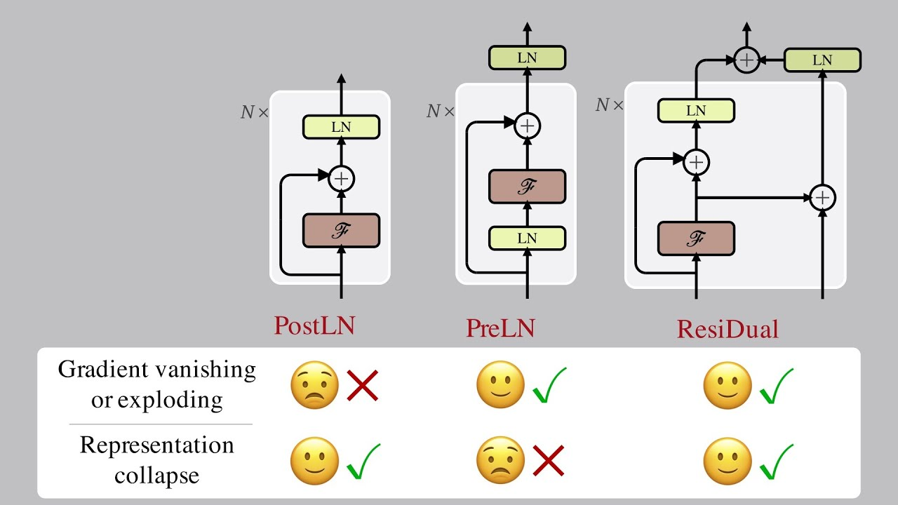
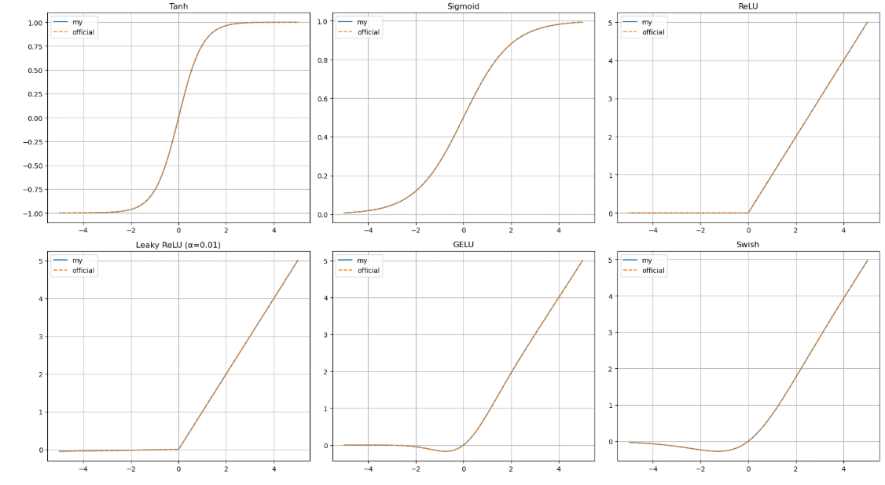

# Transformer中的各个环节

## 1.Normalization

### 1.1 layer normalization

#### 1.1.1 公式

$$
\mu_{c} = \frac{1}{N}\sum_{c=1}^Nx_{i,c}
$$

$$
\sigma_{c}^2=\frac{1}{N}\sum(x_{i,c} - \mu_c)^2
$$

$$
\hat{x}_{i,c}=\frac{x_{i,c}-\mu_c}{\sqrt{\sigma_c^2 + \epsilon}}
$$

#### 1.1.2 缩放和平移

$$
y_{i,c} = W\hat{x}_{i,c}+b \quad \text{W b are both learned params}
$$


### 1.2 batch normalization

#### 1.2.1公式

$$
\mu_{i} = \frac{1}{N}\sum_{i=1}^Nx_{i,c}
$$


$$
\sigma_{i}^2=\frac{1}{N}\sum(x_{i,c} - \mu_i)^2
$$


$$
\hat{x}_{i,c}=\frac{x_{i,c}-\mu_i}{\sqrt{\sigma_i^2 + \epsilon}}
$$

#### 1.2.2缩放和平移

$$
y_{i,c} = W\hat{x}_{i,c}+b \quad \text{W b are both learned params}
$$

### 1.3 rms normalization

#### 1.3.1公式

$$
r_i=\sqrt{\frac{1}{C}\sum_{c=1}^Cx_{i,c}^2+\epsilon}
$$

$$
\hat{x}_{i,c}=\frac{x_{i,c}}{r_i}
$$

#### 1.3.2缩放

$$
y_{i,c} = W\hat{x}_{i,c}
$$


### 1.4 Code

```python3
import torch
import torch.nn as nn
import matplotlib.pyplot as plt
import numpy as np

# 为保证结果可复现
torch.manual_seed(42)
np.random.seed(42)

# 参数设置
batch_size = 64
feature_size = 128
epsilon = 1e-5

# 生成数据：设置非零均值和较大的方差以便观察归一化效果
x = torch.randn(batch_size, feature_size) * 2 + 5  # 均值5，标准差2

# ---------------------------
# 1. 手动实现归一化
# ---------------------------

def manual_batch_norm(x, eps=epsilon):
    # 对每个特征在 batch 内计算均值和方差
    mean = x.mean(dim=0, keepdim=True)
    var = x.var(dim=0, unbiased=False, keepdim=True)
    x_norm = (x - mean) / torch.sqrt(var + eps)
    return x_norm

def manual_layer_norm(x, eps=epsilon):
    # 对每个样本在特征维度上计算均值和方差
    mean = x.mean(dim=1, keepdim=True)
    var = x.var(dim=1, unbiased=False, keepdim=True)
    x_norm = (x - mean) / torch.sqrt(var + eps)
    return x_norm

def manual_rms_norm(x, eps=epsilon):
    # 对每个样本计算均方根（RMS）归一化，不做中心化
    # 计算平方平均值，然后开根号
    rms = torch.sqrt((x ** 2).mean(dim=1, keepdim=True) + eps)
    x_norm = x / rms
    return x_norm

# ---------------------------
# 2. 使用官方归一化模块
# ---------------------------
# 由于我们这里数据是 (batch, feature) 形式，使用 BatchNorm1d 和 LayerNorm

# 官方 BatchNorm1d
bn_official = nn.BatchNorm1d(feature_size, eps=epsilon)
# 将 weight 初始化为1，bias初始化为0
with torch.no_grad():
    bn_official.weight.fill_(1.0)
    bn_official.bias.fill_(0.0)

# 官方 LayerNorm
ln_official = nn.LayerNorm(feature_size, eps=epsilon)
with torch.no_grad():
    ln_official.weight.fill_(1.0)
    ln_official.bias.fill_(0.0)
    
# 官方 RMSNorm
rms_official = nn.RMSNorm(feature_size, eps=epsilon)
with torch.no_grad():
    rms_official.weight.fill_(1.0)
    #rms_official.bias.fill_(0.0)

# ---------------------------
# 3. 应用归一化方法
# ---------------------------
x_manual_bn  = manual_batch_norm(x)
x_manual_ln  = manual_layer_norm(x)
x_manual_rms = manual_rms_norm(x)

x_official_bn = bn_official(x)
x_official_ln = ln_official(x)
x_official_rms = rms_official(x)

# ---------------------------
# 4. 可视化对比
# ---------------------------
# 定义一个函数绘制直方图
def plot_hist(data, title, ax):
    # 将 tensor 转换为 numpy 数组
    data_np = data.detach().cpu().numpy().flatten()
    ax.hist(data_np, bins=50, alpha=0.7, edgecolor='black')
    ax.set_title(title)
    ax.grid(True)

# 绘制原始数据与各种归一化后的直方图
fig, axes = plt.subplots(2, 4, figsize=(15, 8))
# fig.suptitle("", fontsize=16)

plot_hist(x, "data", axes[0, 0])
plot_hist(x_manual_bn, "my Batch Norm", axes[0, 1])
plot_hist(x_official_bn, "official BatchNorm1d", axes[0, 2])
plot_hist(x_manual_ln, "my Layer Norm", axes[0, 3])
plot_hist(x_official_ln, "official LayerNorm", axes[1, 0])
plot_hist(x_manual_rms, "my RMS Norm", axes[1, 1])
plot_hist(x_official_rms, "official RMS Norm", axes[1, 2])

plt.tight_layout(rect=[0, 0, 1, 0.95])
plt.show()
```


### 1.5 FAQ

#### 1.5.1为什么rms没有偏置？

答：RMSNorm 不做中心化，保留了原始方向的信息，而layer norm和batch norm减去了均值，需要加上一个bias；并且这么做减少了计算量。

#### 1.5.2 preLn和postLn的区别是什么？

答：preLn可以保证在每个子层输入时数据分布较为稳定，从而避免残差连接中信号的衰减或爆炸，特别是在深层网络中更为明显；preLn 模型在训练深层 Transformer 时更容易收敛，同时在大规模预训练任务中表现出更好的稳定性，但一般来说postLn的性能可能更好一些。


$$
Output = x+subLayer(LayerNorm(x)) \quad \text{PreLn:Both attention and FFN are sub-layers}
$$

$$
Output=LayerNorm(x+subLayer(x)) \quad \text{PostLn:Both attention and FFN are sub-layers}
$$


## 2.激活函数

### 2.1 Tanh

#### 2.1.1 公式

$$
tanh(x)=\frac{e^x-e^{-x}}{e^x+e^{-x}}
$$

### 2.2 Sigmoid

#### 2.2.1 公式

$$
\sigma(x)=\frac{1}{1+e^{-x}}
$$


### 2.3 ReLU 

#### 2.3.1 公式

$$
ReLU(x)=max(0,x)
$$


### 2.4 Leaky ReLU

#### 2.4.1 公式

$$
Leaky ReLU(x)=max(x,\alpha{x})
$$


### 2.5 GELU

#### 2.5.1 公式

$$
\text{GELU}(x) = x \cdot \Phi(x)
$$

$$
\text{GELU}(x) \approx 0.5\, x \left(1 + \tanh\left(\sqrt{\frac{2}{\pi}} \left(x + 0.044715\, x^3\right)\right)\right)
$$


### 2.6 Swish

#### 2.6.1 公式

$$
\text{Swish}(x) = x \cdot \sigma(x) = \frac{x}{1 + e^{-x}}
$$


### 2.7 GLU

#### 2.6.1 公式

$$
\text{GLU}(X) = A \otimes \sigma(B)
$$

$$
SwiGLU(x)=(W_1x+b_1)\otimes Swish(W_2x+b_2) \quad \text{bias can be removed sometimes}
$$

$$
GeGLU(x)=(W_1x+b_1)\otimes GELU(W_2x+b_2) \quad \text{bias can be removed sometimes}
$$

### 2.7 Softmax

#### 2.6.1 公式

$$
\text{Softmax}(z_i) = \frac{e^{z_i}}{\sum_j e^{z_j}}
$$

### 2.8 Code

```pytohn3
import torch
import torch.nn.functional as F
import matplotlib.pyplot as plt
import numpy as np

# ---------------------------
# 手动实现各个激活函数
# ---------------------------
def custom_tanh(x):
    # Tanh: (exp(x)-exp(-x))/(exp(x)+exp(-x))
    return (torch.exp(x) - torch.exp(-x)) / (torch.exp(x) + torch.exp(-x))

def custom_sigmoid(x):
    # Sigmoid: 1/(1+exp(-x))
    return 1 / (1 + torch.exp(-x))

def custom_relu(x):
    # ReLU: max(0, x)
    return torch.where(x > 0, x, torch.zeros_like(x))

def custom_leaky_relu(x, alpha=0.01):
    # Leaky ReLU: max(x, alpha*x)
    return torch.where(x > 0, x, alpha * x)

def custom_gelu(x):
    # GELU 近似公式:
    # GELU(x) ≈ 0.5 * x * (1 + tanh( sqrt(2/π) * (x + 0.044715 * x^3) ))
    return 0.5 * x * (1 + torch.tanh(torch.sqrt(torch.tensor(2 / np.pi)) * (x + 0.044715 * x**3)))

def custom_swish(x):
    # Swish: x * sigmoid(x)
    return x * custom_sigmoid(x)

# ---------------------------
# 官方实现（使用 PyTorch 内置函数）
# ---------------------------
# PyTorch 对于 Tanh、Sigmoid、ReLU、Leaky ReLU 和 GELU 都有内置实现
# Swish 在官方中没有单独封装，通常直接写为 x * sigmoid(x)

# ---------------------------
# 构造输入数据用于绘图
# ---------------------------
x = torch.linspace(-5, 5, 1000)

# 计算手动实现的各激活函数结果
manual_tanh = custom_tanh(x)
manual_sigmoid = custom_sigmoid(x)
manual_relu = custom_relu(x)
manual_leaky_relu = custom_leaky_relu(x)
manual_gelu = custom_gelu(x)
manual_swish = custom_swish(x)

# 计算官方实现的各激活函数结果
official_tanh = torch.tanh(x)
official_sigmoid = torch.sigmoid(x)
official_relu = F.relu(x)
official_leaky_relu = F.leaky_relu(x, negative_slope=0.01)
official_gelu = F.gelu(x)  # 注意：F.gelu 使用了同样的近似公式
official_swish = x * torch.sigmoid(x)

# ---------------------------
# 绘图对比
# ---------------------------
fig, axs = plt.subplots(2, 3, figsize=(18, 10))
axs = axs.flatten()

# 1. Tanh 对比
axs[0].plot(x.numpy(), manual_tanh.numpy(), label='my')
axs[0].plot(x.numpy(), official_tanh.numpy(), '--', label='official')
axs[0].set_title("Tanh")
axs[0].legend()
axs[0].grid(True)

# 2. Sigmoid 对比
axs[1].plot(x.numpy(), manual_sigmoid.numpy(), label='my')
axs[1].plot(x.numpy(), official_sigmoid.numpy(), '--', label='official')
axs[1].set_title("Sigmoid")
axs[1].legend()
axs[1].grid(True)

# 3. ReLU 对比
axs[2].plot(x.numpy(), manual_relu.numpy(), label='my')
axs[2].plot(x.numpy(), official_relu.numpy(), '--', label='official')
axs[2].set_title("ReLU")
axs[2].legend()
axs[2].grid(True)

# 4. Leaky ReLU 对比
axs[3].plot(x.numpy(), manual_leaky_relu.numpy(), label='my')
axs[3].plot(x.numpy(), official_leaky_relu.numpy(), '--', label='official')
axs[3].set_title("Leaky ReLU (α=0.01)")
axs[3].legend()
axs[3].grid(True)

# 5. GELU 对比
axs[4].plot(x.numpy(), manual_gelu.numpy(), label='my')
axs[4].plot(x.numpy(), official_gelu.numpy(), '--', label='official')
axs[4].set_title("GELU")
axs[4].legend()
axs[4].grid(True)

# 6. Swish 对比
axs[5].plot(x.numpy(), manual_swish.numpy(), label='my')
axs[5].plot(x.numpy(), official_swish.numpy(), '--', label='official')
axs[5].set_title("Swish")
axs[5].legend()
axs[5].grid(True)

plt.tight_layout()
plt.show()
```

```python3
# softmax的实现
import torch
def my_softmax(x, dim):
    """
    手写实现 softmax 函数，利用 torch 中的操作
    参数:
      x: 输入张量
      dim: 指定计算 softmax 的维度
    返回:
      softmax 后的结果，和 torch.softmax 的输出一致
    """
    # 为了数值稳定性，先减去在 dim 维度上的最大值
    x_max, _ = torch.max(x, dim=dim, keepdim=True)
    x_stable = x - x_max
    
    # 计算指数
    exp_x = torch.exp(x_stable)
    
    # 对指定维度求和
    sum_exp_x = torch.sum(exp_x, dim=dim, keepdim=True)
    
    # 除以和，得到 softmax
    return exp_x / sum_exp_x

# 示例：创建一个二维张量
x = torch.tensor([[1.0, 2.0, 3.0],
                  [1.0, 2.0, 3.0]])

# 使用手写的 softmax，沿着第 1 个维度（行）计算
output = my_softmax(x, dim=1)
print(output)
```

```python3
import torch
import torch.nn as nn

class GLULayer(nn.Module):
    def __init__(self, input_dim, output_dim):
        """
        创建一个 GLU 层，其中：
        - input_dim: 输入的特征维度
        - output_dim: 输出的特征维度，通常 output_dim = input_dim 或其它要求
        """
        super(GLULayer, self).__init__()
        # 定义一个线性层，其输出维度是2倍的 output_dim
        self.linear = nn.Linear(input_dim, output_dim * 2)
        
    def forward(self, x):
        # 先进行线性变换，得到的张量形状为 [..., output_dim * 2]
        x_proj = self.linear(x)
        # 将最后一维均分为两部分，a为主要信息，b为门控分支
        a, b = torch.chunk(x_proj, 2, dim=-1)
        # 返回 a 与 sigmoid(b) 的逐元素乘积
        return a * torch.sigmoid(b)

# 示例使用
x = torch.randn(4, 10)  # 假设输入维度为10
glu_layer = GLULayer(input_dim=10, output_dim=10)
output = glu_layer(x)
print(output.shape)  # 输出 shape: torch.Size([4, 10])
```



### 2.9 FAQ

#### 2.9.1 介绍一下 FFN 块 计算公式？

答：公式如下:
$$
\text{FFN}(x) = W_2 \left(\sigma(W_1 x + b_1)\right) + b_2 
$$
其中：
$$
\sigma= ReLU(x) \quad \text{or GELU(x)}
$$

#### 2.9.2 为什么Tanh和Sigmoid用的越来越少？

答：它们存在梯度消失问题，此外ReLU因为不够平滑和存在神经元死亡的问题也比较少用了。

#### 2.9.4 为什么LLM倾向于使用门控机制的激活函数？

答：1.门控机制允许网络在不同的输入条件下动态地调节信息流。通过引入一个门控分支，模型可以“选择性”地保留或抑制某些特征。例如，在 GLU 或其变体（如 SwiGLU）中，这种设计使得模型在处理复杂输入时能够更加灵活，适应不同场景和特征分布，从而提升表达能力。2.门控激活函数不仅仅引入了非线性变换，还增加了参数化的门控分支，这一分支可以看作是一种自适应的特征选择机制。与单一的激活函数（如 ReLU 或 GELU）相比，这种机制能捕捉到更细粒度的非线性关系，使得模型能够建模更复杂的函数映射。3.在深层网络中，梯度消失或梯度爆炸的问题常常限制模型的训练。门控机制通过引入额外的线性通道（即使在负区域也能传递部分信息），可以在一定程度上缓解这些问题。4.现代大型模型（如 LLM）往往需要在有限的参数量下表达非常复杂的模式。门控机制允许模型以较少的参数实现更复杂的功能，因为门控分支可以根据不同输入动态地调节信息流，从而实现类似“专家选择”的效果。这种机制能够在保证灵活性的同时，提高参数的利用效率。当然Google原论文将这个答案归咎为玄学。

## 3.位置编码

### 3.1公式

$$
x=[x_0,x_1,x_2,x_3,...x_{d-2},x_{d-1}]
$$

$$
u_k = x_{2k} + i\,x_{2k+1}\quad (k=0,\dots,\tfrac d2-1).
$$

本质上就是 寻找一个满足一个方程的解：$<f_q(x_m,m),f_k(x_n,n)>=g(x_m,x_n,m-n)$。

rope提出了以下可行解：
$$
f_q(x_m,m)=(W_qx_m)e^{im\theta}
$$

$$
f_k(x_n,n)=(W_kx_n)e^{in\theta}
$$

$$
g(x_m,x_n,m-n)=Re[(W_qx_m)(W_kx_n)^*e^{i(m-n)\theta}]
$$

证明如下：
$$
\text{Attention Score} = Re\left( f_q(x_m, m) \times f_k(x_n, n)^* \right)
$$

$$
f_q(x_m, m) = (W_q x_m) e^{i m \theta}
$$

$$
f_k(x_n, n)^* = \left((W_k x_n) e^{i n \theta}\right)^* = (W_k x_n)^* e^{-i n \theta}
$$

$$
f_q(x_m, m) \times f_k(x_n, n)^* = (W_q x_m) (W_k x_n)^* e^{i m \theta} e^{-i n \theta}
= (W_q x_m) (W_k x_n)^* e^{i (m-n)\theta}
$$

$$
e^{im\theta}=\cos{(m\theta)}+i\sin(m\theta)
$$

$$
e^{in\theta}=\cos{(n\theta)}+i\sin(n\theta)
$$


记：
$$
W_qx_m = \begin{pmatrix} q^{(1)} \\ q^{(2)} \end{pmatrix} =q_m
\quad,\quad
W_kx_n = \begin{pmatrix} k^{(1)} \\ k^{(2)} \end{pmatrix}=k_n
$$

$$
f_q(x_m,m) =
\begin{pmatrix}
\cos(m\theta) & -\sin(m\theta) \\
\sin(m\theta) & \cos(m\theta)
\end{pmatrix}
\begin{pmatrix}
q^{(1)} \\ q^{(2)}
\end{pmatrix}
$$

因为二维向量也可以写成复数形式，所以：
$$
f_q(x_m,m) =(W_qx_m)e^{im\theta}\\=q_me^{im\theta} \\
= (q_m^1+iq_m^2)*(cos(m\theta)+isin(m\theta))\\
= (q_m^1cos(m\theta)-q_m^2sin(m\theta))+i(q_m^2cos(m\theta)+q_m^1sin(m\theta))\\
= [q_m^1cos(m\theta)-q_m^2sin(m\theta),q_m^2cos(m\theta)+q_m^1sin(m\theta)]\\
=\begin{pmatrix}
\cos(m\theta) & -\sin(m\theta) \\
\sin(m\theta) & \cos(m\theta)
\end{pmatrix}
\begin{pmatrix}
q^{1} \\ q^{2}
\end{pmatrix}\quad \text{本行中的所有上标1和2，代表的都是index，并非平方}
$$

$$
g(x_m, x_n, m-n) = \text{Re} \left[ (W_q x_m)(W_k x_n)^* e^{i(m-n)\theta} \right]\\
= \text{Re}\left[ (q_m^{(1)} + i q_m^{(2)})(k_n^{(1)} - i k_n^{(2)})(\cos((m-n)\theta) + i\sin((m-n)\theta)) \right]\\
= \text{Re}\left[ (q_m^{(1)} k_n^{(1)} + q_m^{(2)} k_n^{(2)}) \cos((m-n)\theta) 
- (q_m^{(2)} k_n^{(1)} - q_m^{(1)} k_n^{(2)}) \sin((m-n)\theta) + i(\cdots) \right]\\
= (q_m^{(1)} k_n^{(1)} + q_m^{(2)} k_n^{(2)}) \cos((m-n)\theta) 
- (q_m^{(2)} k_n^{(1)} - q_m^{(1)} k_n^{(2)}) \sin((m-n)\theta)
$$

$$
\langle f_q(x_m, m), f_k(x_n, n) \rangle
=
\left(
\begin{pmatrix}
\cos(m\theta) & -\sin(m\theta) \\
\sin(m\theta) & \cos(m\theta)
\end{pmatrix}
\begin{pmatrix}
q_m^{(1)} \\
q_m^{(2)}
\end{pmatrix}
\right)^T
\left(
\begin{pmatrix}
\cos(n\theta) & -\sin(n\theta) \\
\sin(n\theta) & \cos(n\theta)
\end{pmatrix}
\begin{pmatrix}
k_n^{(1)} \\
k_n^{(2)}
\end{pmatrix}
\right)\\
=
\begin{pmatrix}
q_m^{(1)} & q_m^{(2)}
\end{pmatrix}
\begin{pmatrix}
\cos(m\theta) & \sin(m\theta) \\
-\sin(m\theta) & \cos(m\theta)
\end{pmatrix}
\begin{pmatrix}
\cos(n\theta) & -\sin(n\theta) \\
\sin(n\theta) & \cos(n\theta)
\end{pmatrix}
\begin{pmatrix}
k_n^{(1)} \\
k_n^{(2)}
\end{pmatrix}\\
=
\begin{pmatrix}
q_m^{(1)} & q_m^{(2)}
\end{pmatrix}
\begin{pmatrix}
\cos((m-n)\theta) & -\sin((m-n)\theta) \\
\sin((m-n)\theta) & \cos((m-n)\theta)
\end{pmatrix}
\begin{pmatrix}
k_n^{(1)} \\
k_n^{(2)}
\end{pmatrix}
$$

其中$\theta_{i}=10000^{-2i/d}$

### 3.2代码

```python3
import torch
import math

def build_rope_cache(d_model, seq_len, device=None):
    """预计算所有位置和维度对应的 cos/sin 矩阵"""
    inv_freq = 1.0 / (10000 ** (torch.arange(0, d_model, 2) / d_model))
    positions = torch.arange(seq_len, device=device).unsqueeze(1)  # [L,1]
    angles = positions * inv_freq.unsqueeze(0)  # [L, d_model/2]
    cos = torch.cos(angles)  # [L, d_model/2]
    sin = torch.sin(angles)  # [L, d_model/2]
    return cos, sin

def apply_rope(x, cos, sin):
    """对 x: [batch, seq_len, d_model] 应用 RoPE"""
    x1 = x[..., ::2]  # even dims
    x2 = x[..., 1::2] # odd dims
    x_even = x1 * cos - x2 * sin
    x_odd  = x1 * sin + x2 * cos
    # 重新 interleave
    x_rot = torch.stack([x_even, x_odd], dim=-1).reshape_as(x)
    return x_rot

def rope_attention(q, k, v, cos, sin):
    """
    基于 RoPE（Rotary Positional Encoding）的自注意力计算
    q, k, v: [batch, seq_len, d_model]
    cos, sin: 对应的正余弦值
    """
    # 应用 RoPE 旋转
    q_rot = apply_rope(q, cos, sin)
    k_rot = apply_rope(k, cos, sin)

    # 计算注意力分数
    attn_scores = torch.matmul(q_rot, k_rot.transpose(-2, -1)) / math.sqrt(q.size(-1))

    # 使用 softmax 计算注意力权重
    attn_weights = torch.nn.functional.softmax(attn_scores, dim=-1)

    # 计算最终输出
    output = torch.matmul(attn_weights, v)

    return output, attn_weights

# 使用示例
batch_size = 2
seq_len = 10
d_model = 8

# 随机生成 q, k, v（模拟输入数据）
q = torch.randn(batch_size, seq_len, d_model)
k = torch.randn(batch_size, seq_len, d_model)
v = torch.randn(batch_size, seq_len, d_model)

# 计算位置编码（cos, sin）
cos, sin = build_rope_cache(d_model, seq_len)

# 计算基于 RoPE 的自注意力
output, attn_weights = rope_attention(q, k, v, cos, sin)

print("Output:", output)
print("Attention Weights:", attn_weights)
```

